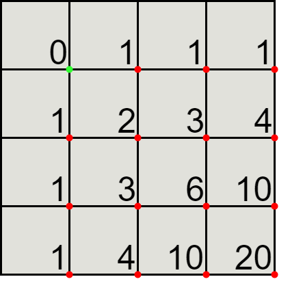

# Dynamic programming

The [Brute force](solution1.md) solution is not efficient at all, for example,
if we go down and then right or right and then down, we end up in the same
place. The [Brute force](solution1.md) solution will compute the answer twice.

We could use a cache, but let's do this solution iteratively rather than 
recursively.

We can represent the solution using a matrix, for example, for a \\( 3 \times 3
\\) square, we have the number of paths from the green point to the red point
for each sub parallelogram.

<p align="center">  </p>

Looking at the \\( 2 \times 2 \\) sub square, we can see that the number of
different paths is indeed 6.

For each red point, the number of different paths to it is the sum of the path
above and paths on the left.

For the first row and column, the number of different paths is one: either only
downs or only rights. Then, we can simply compute the path to the other red
points using the old ones, we simply return the value at the last cell.

From [solution2.py](https://github.com/turtlesmoke/project-euler/blob/main/problems/problem_0015/solution2.py):

```python
def lattice_paths(n=20):
    n += 1
    paths = np.zeros((n, n), dtype=int)

    for i in range(1, n):
        paths[i, 0] = 1
        paths[0, i] = 1

    for i in range(1, n):
        for j in range(1, n):
            paths[i, j] = paths[i - 1, j] + paths[i, j - 1]

    return paths[n - 1, n - 1]
```
